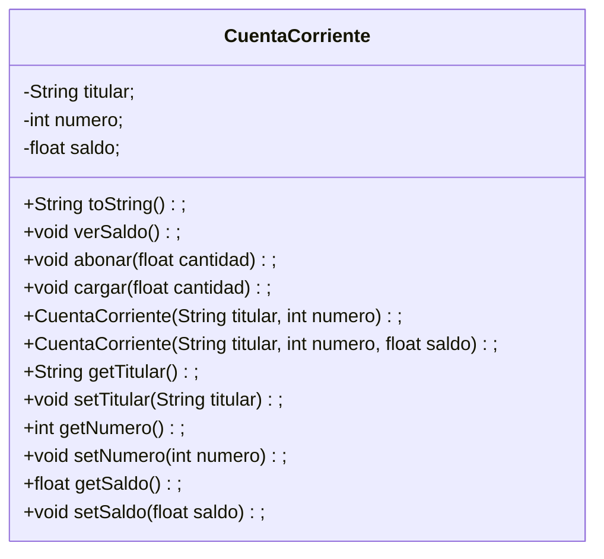

# Requerimientos 1
1. En un proyecto llamado `AppCuentaCorriente`, crea el package `cuentas` con una clase llamada `CuentaCorriente`
que tendrá los siguientes atributos: `titular (String)`, `saldo (numérico con decimales)` y `número (numérico)`.

2. El titular y el número serán **obligatorios**, el saldo es opcional. Crea los constructores que cumplan lo anterior.

3. Crea métodos get y set para los atributos, y uno `toString` que muestre los atributos de la clase en un string con formato.

4. Tendrá dos métodos extra:
  - `abonar`: recibe por parámetro la cantidad que se debe abonar al saldo de la cuenta. Si la cantidad es un número negativo, no se debe alterar el saldo.
  - `cargar`: recibe por parámetro la cantidad que se debe cargar al sado de la cuenta. Si restando la cantidad actual a la que nos pasan es negativa, la cantidad de la cuenta pasa a ser 0.

5. En el método `main` de la clase principal del proyecto, instancie las clases y consuma los métodos para probar las diversas casuísticas.

Clase extra agregada `verSaldo()` imprime el saldo en pantalla

# Requerimientos 2
1. Base su solución en lo escrito en la versión anterior. Implemente las mejoras que considere necesarias fruto de lo aprendido durante esta unidad.

2. Valide que los datos enviados por parámetros- en especial los envaidos a métodos set - corresponden a los tipos de datos solicitados, por medio de la implementación de clausulas try-catch.

3. Cree la Clase “Movimientos”, que contiene atributos de tipo de movimiento – abono o cargo-, fecha y monto, entro del package cuentas.

4. Cree un nuevo atributo en la clase CuentaCorriente, un array de tipo Movimientos, y que contenga los últimos 10 movimientos.

5. Modifque los métdos abonar y cargar, para que guarden un registro de los últimos movimientos en el array de Movimientos.

6. En el metodo Main de la clase principal de proyecto, instancie las clases y consuma los métodos para probar las diversas casuisticas.

### UML Proyecto:

|  **Simbolo**   |   `-`   |   `+`   |   `$`    |
|:--------------:|:-------:|:-------:|:--------:|
| **Definición** | privado | publico | estatico |

